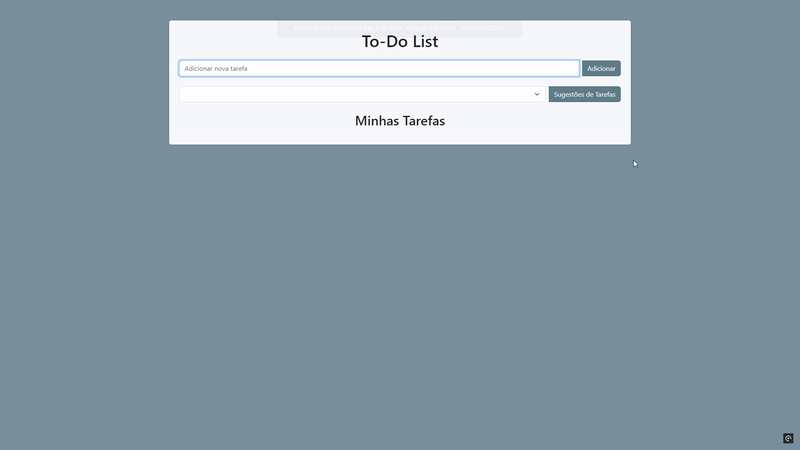
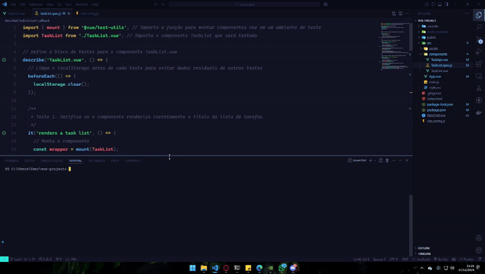

# 📝 To-Do List

### Repository dedicated to a personal project: an easy and interactive system to help organize personal tasks.

 <!-- Replace with the actual path of your GIF -->

---

## 🌐 Language Selection | Selecione o Idioma 

[](#english) 
[](#portuguese)

---
<a name="english"></a>

## 🔵 English (EN)

### Context

The idea for the system arose from a selection process in which it was suggested to develop a task management system (To-do List). The goal was to create an interactive and intuitive application, focusing on user experience, for those who wish to manage their activities more effectively. During development, I sought to implement features that not only meet the basic needs of a task list but also offer a pleasant and easy-to-navigate interface.

### What does the app do?

The system was developed to help with task organization, allowing users to add new tasks manually or fetch task suggestions through a public API. It offers functionalities such as marking tasks as completed, removing them from the list, and ensuring that tasks persist after the page is reloaded using **localStorage**.

The interface is intuitive, providing a simple and effective experience for managing daily activities. Additionally, the implementation of **unit tests (vitest)** ensures that task addition and storage updates are working correctly, guaranteeing the system's reliability. The goal is to facilitate task management and increase user productivity.

### Conclusion

The goal of the **To-Do List** is to be a practical, interactive, and easy-to-use tool, meeting my need for task organization in an intuitive and simplified manner. The app was developed with a focus on usability, aiming to help not only myself but anyone with a similar need to get organized.

---
<a name="portuguese"></a>

## 🟢 Português (PT-BR) 

### Contexto

A ideia para o sistema surgiu a partir de um processo seletivo no qual foi sugerido desenvolver um sistema de gerenciamento de tarefas (To-do List). O objetivo foi criar uma aplicação interativa e intuitiva, com foco na experiência do usuário, para aqueles que desejam gerenciar suas atividades de forma mais eficaz. Durante o desenvolvimento, busquei implementar funcionalidades que não apenas atendem às necessidades básicas de uma lista de tarefas, mas também oferecem uma interface agradável e de fácil navegação

### O que o app faz?

O sistema foi desenvolvido para ajudar na organização de tarefas, permitindo que os usuários adicionem novas tarefas manualmente ou busquem sugestões de tarefas por meio de uma API pública. Ele oferece funcionalidades como marcar tarefas como concluídas, removê-las da lista e garantir que as tarefas persistam após o recarregamento da página usando o **localStorage**.

A interface é intuitiva, proporcionando uma experiência simples e eficaz para gerenciar as atividades diárias. Além disso, a implementação de **testes unitários** (vitest) assegura que a adição de tarefas e a atualização do armazenamento estejam funcionando corretamente, garantindo a confiabilidade do sistema. O objetivo é facilitar o gerenciamento de tarefas e aumentar a produtividade dos usuários.

### Conclusão

O objetivo do **To do List** é ser uma ferramenta prática, interativa e fácil de usar, suprindo minha necessidade de organização de tarefas de maneira intuitiva e simplificada. O app foi desenvolvido com foco na usabilidade, com o intuito de ajudar não só a mim, mas qualquer pessoa que tenha uma necessidade semelhante em se organizar.

---

## 🚀 Installation | Instalação 

#### 🔵 English:
The application was created using Vite, a fast build tool for modern web projects. To create the project, the command npm create vite@latest vue-project --template vue was used, which creates a new Vue.js project using Vite's default template. After creating the project, it was necessary to install the npm dependencies with the commands cd vue-project and npm install.

Below are the step-by-step instructions to get the app running on your local environment.

#### 🟢 Português:
O aplicativo foi criado utilizando o Vite, uma ferramenta de build rápida para projetos web modernos. Para criar o projeto, foi utilizado o comando npm create vite@latest vue-project --template vue, que cria um novo projeto Vue.js utilizando o template padrão do Vite. Após a criação do projeto, foi necessário instalar as dependências do npm com os comandos cd vue-project e npm install.

Abaixo estão as instruções passo a passo para fazer o sistema funcionar no seu ambiente local.


```bash
# Clone the repository and access it
git clone https://github.com/Gabriieelcosta/Teste-Vue-To-Do-List.git
cd vue-project

# Install dependencies
npm install

# Inicie o servidor de desenvolvimento:
npm run dev

```

---

## 🧪 How to run unit tests | Como rodar os testes unitários

#### 🔵 English:

I chose Vitest for unit testing in my project because of its seamless integration with Vite, providing simple configuration and fast execution. It leverages Vite's speed, making it ideal for projects.

To configure and run unit tests with Vitest in your project, follow these steps:

### Installing Vitest and running it

```bash
# First, install Vitest and its dependencies in your project. Run the following command in the terminal:
npm install --save-dev vitest @vitest/ui

# Vite Configuration
If you already have the basic Vitest configuration in your vite.config.js file, make sure it is configured correctly as shown below:

import { defineConfig } from 'vitest/config';
import vue from '@vitejs/plugin-vue';

# Running the Tests
To run the tests, execute the following command in the terminal:

npx vitest
```
---

#### 🟢 Português:

Escolhi o Vitest para os testes unitários do meu projeto por sua integração perfeita com o Vite, proporcionando configuração simples e execução rápida. Ele aproveita a velocidade do Vite, tornando-o ideal para projetos. 

Para configurar e executar testes unitários com Vitest no seu projeto, siga os seguintes passos:

### Instalação do Vitest e Colocando para rodar

```bash
# Primeiro, instale o Vitest e suas dependências no seu projeto. Execute o seguinte comando no terminal:
npm install --save-dev vitest @vitest/ui

# Configuração do Vite
Se você já possui a configuração básica do Vitest no seu arquivo vite.config.js. Certifique-se de que ele está configurado corretamente, como mostrado abaixo:

import { defineConfig } from 'vitest/config';
import vue from '@vitejs/plugin-vue';

# Executando os Testes
Para rodar os testes, execute o seguinte comando no terminal:

npx vitest

```

 <!-- Replace with the actual path of your GIF -->


